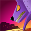

My Projects
===
  
Trying to be productive with my scarce free time to progress in my own independent projects.

<ul>
	<li>
		
		<a href="sheepinhell">Break & Up</a> 
		with {{page.pau}}
	</li>
	<li>
		
		<a href="sheepinhell">Sheep in Hell</a> 
		with {{page.rtypex}}, {{page.atic2a}}
	</li>
	<li>
		
		<a href="http://projectrien.wordpress.com">Rien</a> 
		with {{page.rtypex}}, {{page.ferminho}}, {{page.ismael}}, {{page.lugallegos}}, {{page.alvaro}}, {{page.diego}}
	</li>
	<li>
		
		<a href="http://archive.globalgamejam.org/2012/immaturity">Immaturity</a> 
		with {{page.bud}}, {{page.rtypex}}, Raúl Jordano, {{page.xavi}}
	</li>
</ul>

Myself
===

The name is David Corominas Montes.

Currently employed as a teacher and videogame developer at [FXAnimation Barcelona 3D School](http://www.fxanimation.es), where I tutorize all the students' videogame projects and program them using the Unity engine.

In parallel, and in a sporadic form, I'm doing some consulting work in a couple of projects where we they need to show some real time graphics in a screen or VR headset (Oculus).

Previously worked at [EVENTLab](http://www.event-lab.org/), led by [Mel Slater](http://twitter.com/melslater), where I helped to implement and execute a [VR experiment](http://www.youtube.com/watch?v=QEKxyhSPiVg) with which we were able to measure presence in a virtual environment. [A paper](http://publicationslist.org/data/melslater/ref-200/a92-slater.pdf) resulted from that and was published at SIGGRAPH. We used an optical MoCap system, an HMD and more.

Also worked at [T-Systems CRV Barcelona](http://www.crviberia.com/), a team of experts in interactive VR projects for commercial purposes, using technologies such as CAVE, Powerwall and AR. There I worked creating 3D assets, extending their engine scripting features, etc.
