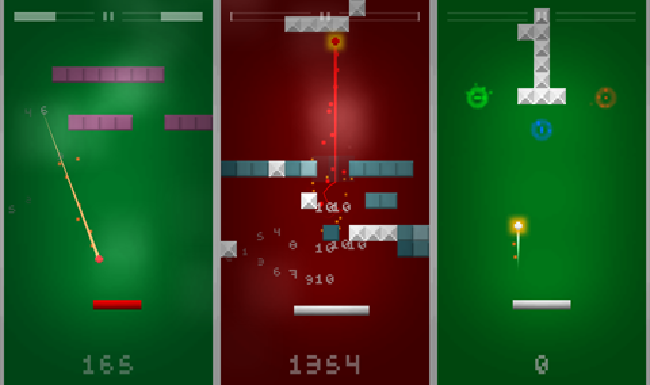

 Break & Up <section class="byline">Published: December 4, 2014</section>
===

Available soon
---

Compatible with iPhone, iPod Touch and iPad.

About the game
---

Take a quick game. Feel the emotion of throwing a pixel ball. Aim at the gap through the blocks mess. And finally enjoy as they collide in a symphony of growing pleasure. Everything becomes faster and harder as your skills improve. Bouncing ball, agile racket, best scores all around! And don't forget to share your results on Twitter!

We all love classics for what they mean in our past life. And it's natural that, once in a while, someone comes with a tribute. That's the reason why **Break & Up** exist! It's a humble, minimal yet addictive Breakout tribute with a spin around continuity, rhythm and briefness.

Features
---
  
- <i class="icon icon-ok"></i>Quick rounds
- <i class="icon icon-ok"></i>Challenging gameplay
- <i class="icon icon-ok"></i>Chainable bounces
- <i class="icon icon-ok"></i>Power-ups
- <i class="icon icon-ok"></i>Reflexes improver
- <i class="icon icon-ok"></i>Engage, keep trying!

Development
---

In this game I wanted to produce situations where the user had to throw a ball and make it bounce into walls in a predictive way. That was the original idea, but had to come up with an objective. And it was clear for me: make it a progress based game, arcade style. The ball simply has to bounce repeatedly to gather points, but to make it interesting, the more it bounces, the fastest it gets, as if it would be angry. Also, for every time the ball touches the racket, the latter gets smaller! So the user has to be efficient in her/his moves.

Graphics wise, it's obvious that I wanted to keep it simple so it didn't consume much of my time. However, it was a requirement to be pleasant to the eyes. I came up with a style that is (in my opinion) both pretty and functional.

As of the music, I tried to do it myself but I'm no musician at all! Luckily, {{page.pau}} offered to compose the main theme. He runs the {{page.atic2a}} team among other projects, but he's also interested in building a solo career. His brilliant work for **Break & Up** is just an example of this adventure of him.

I have to say, nonetheless, that I've been a bit untrue to myself placing ads in this game. I'm of the opinion that ads break the immersion of an experience. But well, it's really like an experiment so I can see how well the method works, and anyway, the ad appears in a moment that doesn't disturb too much.
