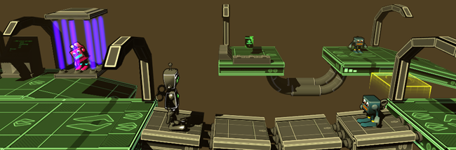

 FXGameSpace 2014 <section class="byline">Published: July 31, 2014</section>
===

About the game
---

  
It's summer and, as every year, lots of kids came to FXAnimation - the school I work to - learn how to make a videogame. The course is simple enough to finish it within a month, but they learn many real concepts, like modelling, texturing, animating and (my part) designing. In the last two weeks, I share with them a Unity project that is ready to start mounting a level for a platform/exploration game, complete with characters, props and scripts.

The result is quite cool, they have fun and know new people with similar interests. I'm pretty content with the current status of the course, that has been better and better every year. That's why I feel like sharing here the four levels I designed and mounted, so that you can play it.

You can download it here: for [Windows](files/FXGameSpace2014_win.zip) and [Mac OS X](files/FXGameSpace2014_mac.zip).
