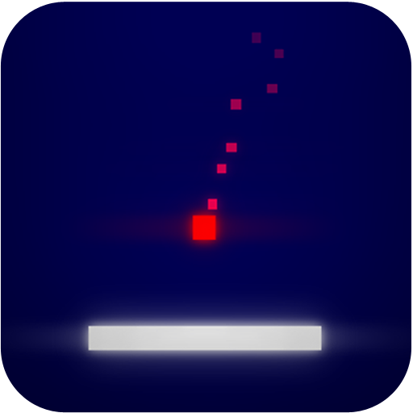
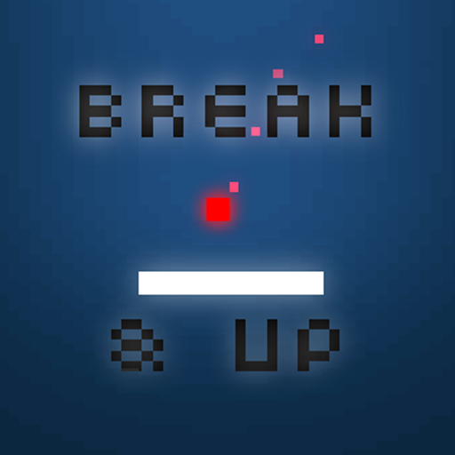
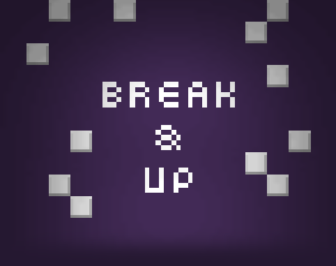

Contents
--------

<ul class="listing">
  <li><i class="icon icon-chevron-right"></i><a href="#factsheet">Factsheet</a></li>
  <li><i class="icon icon-chevron-right"></i><a href="#description">Description</a></li>
  <li><i class="icon icon-chevron-right"></i><a href="#features">Features</a></li>
  <li><i class="icon icon-chevron-right"></i><a href="#history">History</a></li>
  <li><i class="icon icon-chevron-right"></i><a href="#videos">Videos</a></li>
  <li><i class="icon icon-chevron-right"></i><a href="#images">Images</a></li>
  <li><i class="icon icon-chevron-right"></i><a href="#logos">Icon, logo, banner</a></li>
  <li><i class="icon icon-chevron-right"></i><a href="#aboutus">About the team</a></li>
  <li><i class="icon icon-chevron-right"></i><a href="#links">Links</a></li>
  <li><i class="icon icon-chevron-right"></i><a href="#contact">Contact</a></li>
</ul>

Factsheet
---------

	<h3>Team</h3>
	<ul class="listing">
	  <li>Designer: {{site.me}}</li>
	  <li>Artist: {{site.me}}</li>
	  <li>Programmer: {{site.me}}</li>
	  <li>Musician: {{site.pau}}</li>
	  <li>Based in: Spain</li>
	</ul>

	<h3>Game info</h3>
	<ul class="listing">
	  <li>Release date: June 7th, 2017</li>
	  <li>Platforms: iOS, Android</li>
	  <li>Price: Free, Ads supported</li>
	  <li>Official website: <a href="http://david.cm/breakandup">Break &amp; Up! - The Breaking Game Sensation</a></li>
	</ul>

Description
-----------

Take a quick game. Feel the emotion of throwing a pixel ball. Aim at the gap through the blocks mess. And finally enjoy as they collide in a symphony of growing pleasure. Everything becomes faster and harder as your skills improve. Bouncing ball, agile racket, best scores all around... Don't hesitate, share them!

All this fun is perfectly coupled with an awesome adaptive soundtrack that levels up with you!

We all love classics for what they mean in our past life. And it's natural that, once in a while, someone comes with a tribute. That's the reason why Break&Up exists! It's a humble, minimal yet addictive Breakout tribute with a spin around continuity, rhythm and briefness.

Features
--------

<ul class="listing">
  <li><i class="icon icon-ok"></i>Quick rounds</li>
  <li><i class="icon icon-ok"></i>Challenging gameplay</li>
  <li><i class="icon icon-ok"></i>Adaptive soundtrack</li>
  <li><i class="icon icon-ok"></i>Chainable bounces</li>
  <li><i class="icon icon-ok"></i>Power-ups</li>
  <li><i class="icon icon-ok"></i>Reflexes improver</li>
  <li><i class="icon icon-ok"></i>Engage, keep trying!</li>
</ul>

History
-------

In this game I wanted to produce situations where the user had to throw a ball and make it bounce into walls in a predictive way. That was the original idea, but had to come up with an objective. And it was clear for me: make it a progress based game, arcade style. The ball simply has to bounce repeatedly to gather points, but to make it interesting, the more it bounces, the fastest it gets, as if it would be angry. Also, for every time the ball gets back to the racket, it makes it smaller! So the user has to be efficient in her/his moves.

Graphics wise, it's obvious that I wanted to keep it simple so it didn't consume much of my time. However, it was a requirement to be pleasant to the eyes. I came up with a style that is (in my opinion) both pretty and functional.

As of the music, I tried to do it myself but I'm no musician at all! Luckily, {{site.pau}} offered to compose the soundtrack.

I have to say, nonetheless, that I've been a bit untrue to myself placing ads in this game. My opinion is that ads break the immersion and flow of an experience. But well, it's really like an experiment so I can see how well the method works, and anyway, the ad appears in a moment that doesn't disturb too much.

Videos
------

Share video link <a href="https://youtu.be/0K8YgXsy8Nk"><i class="icon icon-external-link"></i></a>

<iframe id="video" frameborder="0" src="https://www.youtube-nocookie.com/embed/0K8YgXsy8Nk?rel=0" allowfullscreen></iframe>

Images
------

Download all <a href="breakandup_contents/screenshots.zip"><i class="icon icon-download-alt"></i></a>

<section class="gallery">

</section>
<section class="minigallery">

</section>

Icons, logo
-----------

Download all <a href="breakandup_contents/logos.zip"><i class="icon icon-download-alt"></i></a>

<section class="gallery">

</section>

About the team
--------------

{{site.pau}} is a music composer, sound designer and pianist. He knows everything about games, especially indie games. Always busy working in various projects or learning new skills.

{{site.me}}

Links
-----

<ul class="listing">
  <li><i class="icon icon-external-link"></i>Official website: <a href="http://www.david.cm/breakandup">Break &amp; Up! - The Breaking Game Sensation</a></li>
  <li><i class="icon icon-external-link"></i>Programmer/artist website: <a href="http://www.david.cm">david.cm</a></li>
  <li><i class="icon icon-external-link"></i>Musician website: <a href="http://www.paudamiariera.com">Pau Damià Riera</a></li>
  <li><i class="icon icon-external-link"></i>Get it: <a href="https://itunes.apple.com/us/app/break-up/id932145454">Apple AppStore</a></li>
  <li><i class="icon icon-external-link"></i>Purchase: <a href="https://play.google.com/store/apps/details?id=cm.david.breakandup">Google Play</a></li>
</ul>

Contact
-------

<ul class="listing">
  <li><a href="http://david.cm/support">Support</a></li>
</ul>

<h3>Social</h3>

<ul class="listing">
  <li><i class="icon icon-twitter"></i><a href="https://twitter.com/tmdchi">Twitter of David Corominas</a> (programmer)</li>
  <li><i class="icon icon-twitter"></i><a href="https://twitter.com/paudamiariera">Twitter of Pau Damià Riera</a> (musicians)</li>
</ul>
