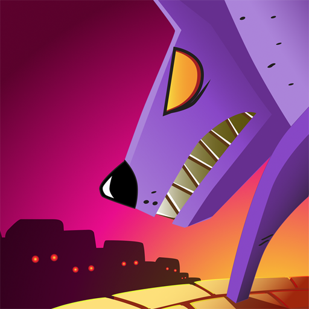
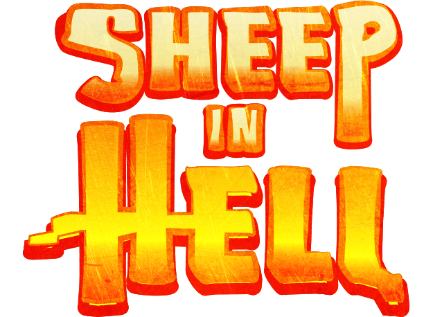
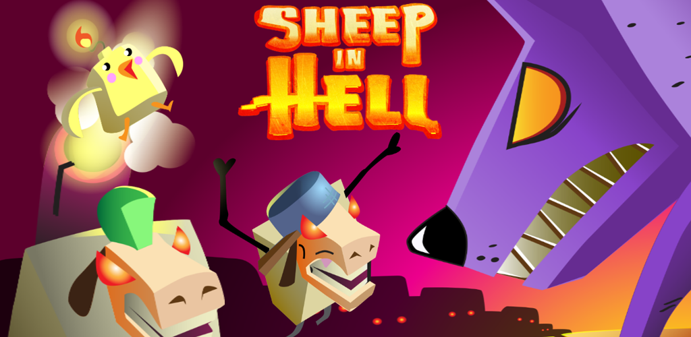

Contenido
---------

<ul class="listing">
  <li><i class="icon icon-chevron-right"></i><a href="#factsheet">Datos básicos</a></li>
  <li><i class="icon icon-chevron-right"></i><a href="#description">Descripción</a></li>
  <li><i class="icon icon-chevron-right"></i><a href="#features">Características</a></li>
  <li><i class="icon icon-chevron-right"></i><a href="#history">Historia</a></li>
  <li><i class="icon icon-chevron-right"></i><a href="#videos">Vídeos</a></li>
  <li><i class="icon icon-chevron-right"></i><a href="#images">Imágenes</a></li>
  <li><i class="icon icon-chevron-right"></i><a href="#logos">Icono, logo, banner</a></li>
  <li><i class="icon icon-chevron-right"></i><a href="#aboutus">Acerca del equipo</a></li>
  <li><i class="icon icon-chevron-right"></i><a href="#links">Enlaces</a></li>
  <li><i class="icon icon-chevron-right"></i><a href="#contact">Contacto</a></li>
</ul>

Factsheet
---------

	<h3>Equipo</h3>
	<ul class="listing">
	  <li>Nombre: Hiccup Games</li>
	  <li>Diseñadores: Ángel García, David Corominas</li>
	  <li>Artista: Ángel García</li>
	  <li>Programador: David Corominas</li>
	  <li>Músicos: Atic2a (Carles Gumí y Pau Damià Riera)</li>
	  <li>Ubicados en: España</li>
	</ul>

	<h3>Información del juego</h3>
	<ul class="listing">
	  <li>Fecha de salida: 7 de enero de 2014</li>
	  <li>Plataformas: iOS, Android</li>
	  <li>Precio habitual: 0.89€</li>
	  <li>Web oficial: <a href="http://david.cm/landing/sheepinhell">Sheep in Hell - Un videojuego por Hiccup Games!</a></li>
	</ul>

Descripción
-----------

Eres un lobo y has sido malo. Es por eso que se te ha llevado a las profundidades de un infierno plagado de tus más odiados enemigos: ¡las ovejas! Pero no son ovejas normales. No... Son endemoniadas ovejas poseídas ¡y no dudarán en intentar matarte!

Por eso corre! Defiéndete! Porque, después de todo, un lobo es un depredador por naturaleza, no una presa.

Ábrete paso por las mazmorras, resuelve retos y escapa de este infierno... ¡Si puedes!

Features
--------

<ul class="listing">
  <li><i class="icon icon-ok"></i>Controles intuitivos y sensibles</li>
  <li><i class="icon icon-ok"></i>Tres niveles de dificultad</li>
  <li><i class="icon icon-ok"></i>Mazmorras procedurales siempre diferentes</li>
  <li><i class="icon icon-ok"></i>Retos de creciente dificultad</li>
  <li><i class="icon icon-ok"></i>Varios enemigos a descubrir</li>
  <li><i class="icon icon-ok"></i>¡Y más!</li>
</ul>

History
-------

Este juego fue originalmente planeado por Ángel y David como un proyecto factible para una Game Jam casera que hicieron el 25 de marzo de 2013. El objetivo era, al menos, intentar terminarlo. Pero si no lo conseguían, también estaría bien. Sin presiones.

La tarea de Ángel consistió en crear cada elemento gráfico: desde el arte conceptual hasta los objetos 3D y las animaciones, interfaz gráfica, texturas...

La tarea de David consistió en programar: generar proceduralmente las salas, gestionar los retos, crear los comportamientos de los enemigos, ajustar los controles del personaje...

La jam duró 3 días y fue difícil e intensiva, pero al final consiguieron algo jugable, algo a lo que podían llamar un juego.

Después de un merecido descanso, retomaron el proyecto y empezaron a trabajar en él durante sus ratos libres. Aproximándose ya a la fase beta, tuvieron el honor de trabajar con Atic2a, un estudio independiente de música y efectos sonoros formado por dos hombres. Hicieron un trabajo espléndido. Se corrigieron muchos bugs, se añadieron muchas novedades, se creó arte de última hora y se hizo algún que otro test de jugabilidad. De repente una Gold Master apareció, justo a tiempo para año nuevo. Así que lo empaquetaron todo y lo distribuyeron.

Vídeos
------

Enlace para compartir <a href="http://youtu.be/6wIvIz8m40s"><i class="icon icon-external-link"></i></a>

<iframe id="video" frameborder="0" src="//www.youtube-nocookie.com/embed/6wIvIz8m40s?rel=0" allowfullscreen></iframe>

Imágenes
--------

Descargar todo <a href="sheepinhell_contents/screenshots.zip"><i class="icon icon-download-alt"></i></a>

<section class="gallery">

</section>
<section class="minigallery">

</section>

Icono, logo, banner
-------------------

Descargar todo <a href="sheepinhell_contents/logos.zip"><i class="icon icon-download-alt"></i></a>

<section class="gallery">

</section>

Acerca del equipo
-----------------

Ángel estudió en una escuela de diseño 3D de Barcelona, donde David trabajaba como tutor para el desarrollo de videojuegos. Allí trabajaron juntos en el proyecto final de Ángel, llamado <a href="http://rtypex.com/juegos/booktrip/">Book Trip</a>. Vistas las habilidades de Ángel para crear todo tipo de contenido 3D, y lo rápido que era, David quiso que formara parte del equipo de producción de un proyecto interno. Durante todo ese tiempo hablaban de, algún día, cooperar en sus propios proyectos fuera de la escuela.

La primera oportunidad de trabajar con total libertad fue en la Global Game Jam de 2012, donde (junto a otras tres personas) crearon un bonito juego llamado <a href="http://archive.globalgamejam.org/2012/immaturity">Immaturity</a>.

Tras un año, se encontraron otra vez para celebrar una Game Jam casera. Ésta fue la culpable de lo que ahora presentan: <b>Sheep in Hell</b>. Fue un proyecto de tres días, un ataque de hipo y un año de perfeccionamiento. Y fue durante este último proceso cuando trabajaron junto a Atic2a, un equipo de dos hombres especializado en la creación de música para videojuegos y efectos sonoros.

Enlaces
-------

<ul class="listing">
  <li><i class="icon icon-external-link"></i>Web oficial: <a href="http://www.david.cm/landing/sheepinhell">Sheep in Hell - Un videojuego por Hiccup Games!</a></li>
  <li><i class="icon icon-external-link"></i>Web del artista: <a href="http://www.rtypex.com">rtypex.com</a></li>
  <li><i class="icon icon-external-link"></i>Web del programador: <a href="http://www.david.cm">david.cm</a></li>
  <li><i class="icon icon-external-link"></i>Web de los músicos: <a href="http://www.atic2a.com">atic2a.com</a></li>
  <li><i class="icon icon-external-link"></i>Adquirir: <a href="https://itunes.apple.com/us/app/sheep-in-hell/id788371896?mt=8">Apple AppStore</a></li>
  <li><i class="icon icon-external-link"></i>Adquirir: <a href="https://play.google.com/store/apps/details?id=cm.david.sheepinhell">Google Play</a></li>
</ul>

Contacto
--------

<ul class="listing">
  <li><a href="http://david.cm/support">Soporte</a></li>
</ul>

<h3>Social</h3>

<ul class="listing">
  <li><i class="icon icon-twitter"></i><a href="https://twitter.com/rtypex">Twitter de Ángel García</a> (artista)</li>
  <li><i class="icon icon-twitter"></i><a href="https://twitter.com/tmdchi">Twitter de David Corominas</a> (programador)</li>
  <li><i class="icon icon-twitter"></i><a href="https://twitter.com/atic2a">Twitter de Atic2a</a> (músicos)</li>
</ul>
