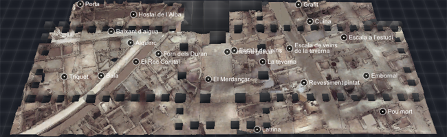
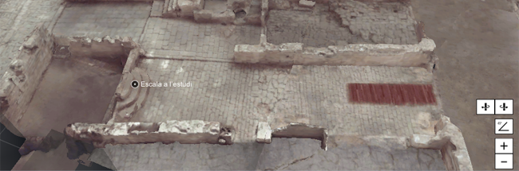

<h1>
{{page.title}}
<section class="byline">Published: April, 2017</section>
</h1>

In Barcelona there is a popular archeological site in the heart of the Born town, where you can find the rests of the old city dating from year 1700. In order to help people know about the history of the place, the goverment wanted to create this mobile app, which made it easy.

These are the two sections that I made:

One is a realistic 3D recreation of the site, made using the latest laser scanning technology, navigatable with standard (as in Google Maps) gestures.

Another is a GPS enabled augmented reality interface with which the user can navigate inside the Born town, seeing an schematic view of how was the town back in the time, while really walking around the streets of today.

Features
---
  
- <i class="icon icon-ok"></i>Realistic graphics for the highly detailed archeological site
- <i class="icon icon-ok"></i>Standard "maps" touch controls
- <i class="icon icon-ok"></i>Optimized for wide variety of mobile phones
- <i class="icon icon-ok"></i>API to communicate with native part of the app (iOS or Android)

Credits
---

- Programming of 3D sections by {{site.me}}
- Led and designed by {{site.creueta119}}
- Native app by {{site.dev33}}
- Scan cleaning and textures by {{site.leonardblum}}
- Geometry fix up by {{site.3dkiwi}}
