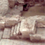

<h1>
{{page.title}}
<section class="byline">Published: September 5, 2017</section>
</h1>

In Barcelona there is a popular archeological site in the heart of the Born town, where you can find the rests of the old city dating from year 1700. In order to help people know about the history of the place, the goverment wanted to create this mobile app, which made it easy.

There are two sections in **{{page.title}}** that I made:

One section is a realistic 3D recreation of the site, made using the latest laser scanning technology, navigatable with standard (as in Google Maps) gestures. Being my responsibility that the final model had to be easily moved by a modest phone, I had to convince the others about the needed low resolution of both geometry and textures. Coming from the excessive detail of scanned data, it always hurts to an artist to remove quality, but in the end we all saw that a drastic reduction still presented very nice quality.

Another section is a GPS enabled, kind of augmented reality interface with which the user can navigate inside the Born town, seeing a schematic view of how was the town back in the time, while really walking around the streets of today. While testing we noticed how much the surrounding buildings affected the GPS signal (Born has many narrow streets!), but obviously that was a problem that would require a solution way beyond our capabilities.

In a final iteration, I also made a web version for the site section, which required an update in the navigation inputs, localization awareness and some cosmetic changes.

Features
---
  
- <i class="icon icon-ok"></i>Realistic graphics for the highly detailed archeological site
- <i class="icon icon-ok"></i>Standard "maps" touch controls
- <i class="icon icon-ok"></i>Optimized for wide variety of mobile phones
- <i class="icon icon-ok"></i>API to communicate with native part of the app (iOS or Android)

Downloads
---

Credits
---

- Programming of 3D sections by {{site.me}}
- Led and designed by {{site.creueta119}}
- Native app by {{site.dev33}}
- Scan cleaning and textures by {{site.leonardblum}}
- Geometry fix up by {{site.3dkiwi}}
