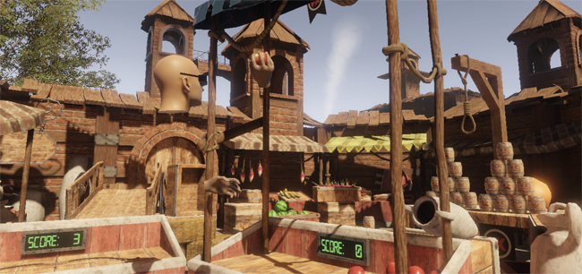

<h1>
{{page.title}}
<section class="byline">Published: June 13, 2019</section>
</h1>

This will serve as a postmortem of one of the last projects I worked in at [FXAnimation](http://www.fxanimation.es).

After some experiments with VR that were basically wanderers to exhibit some of our students nicest environments, we decided to give more interactivity to our next demo. The setting was a medieval market and the director decided it would be cool to make it into a playing field with funfairlike games. That was a great opportunity to implement hand interactions!

There were many game candidates, but in the end we opted to include 3: whac-a-mole (smash moles with a hammer), target shooting (ranged shooting with a bow) and knock down (throwing a ball to a pile of cans). The demo was limited in time to about 3 minutes and in space to 3 squared meters.

<iframe align="center" frameborder="0" allowfullscreen width="576" height="384"
	src="https://www.youtube-nocookie.com/embed/aDOoomZbG_w?rel=0">
</iframe>

I'll comment some of the design decisions that we came up with:

We all know the initial setting is crucial, so that the player gets introduced to his/her new surroundings without rushing his/her into the action too early. To accomplish that, someone proposed a walk in from outside the play area. I wasn't convinced of that because of motion sickness, but sometimes proposals have to be accepted ;) The best way to do that is avoiding velocity changes, so I made the camera to be already moving when the picture fades in. Deceleration in the end of the path was hard to avoid, but ensuring a straight movement and keeping velocity slow enough, motion sickness was reduced to a minimum.

Once in the play area, we had to let the player know what he/she could do. Because extradiegetic UI is against VR paradigms, we opted to use a holographic replica of the user's virtual hands over the interactive spots. This would have not been completely necessary, but in order to accelerate user engagement and to get him/her to focus on the main activity of the experience, this extra visual cue was really helpful.

Also part of the UI was the display of the time left. After some thinking, I opted for going with the most culturally natural way of depicting it: a wristwatch (also holographic, why not?). All users, on entering the virtual world, looked at their hands and noticed the existence of that watch counting down, understanding there was a time limit.

As of interactivity itself, the most important thing was to implement it in the most intuitive way. Everyone knows how to grab an object. Everyone knows how to slam with a hammer or throw a ball. Everyone knows how a bow works. Using the triggers and/or the grab buttons in the controllers made the standard action of closing and opening the hands, and that was enough for any player to use everything in there.

In detail: grabbing an object will position it in the most convenient spot of your hand, and the hand will adapt its tilt and shape to the object. At first I tried without modifying the hand's tilt, thinking that of course the user is just pressing the trigger, so only the fingers sould move to grab the object. But for some reason it didn't feel good and the user had to compensate tilting his/her hand in an unconfortable way. I guess it's because of how the controller is really grabbed and how that doesn't match the depicted empty virtual hand. Luckily doing that virtual hand tilting was unnoticeable for the user, and the interactions felt very natural.

The most difficult part of all this was the ball throwing. It was interesting to see that throwing was not working for 50% of the users. My implementation was to apply a force to the thrown object based on the speed and direction of the hand at the moment of releasing it. But those users saw their objects fly in random directions. It's not that they don't know how to throw objects. Instead, it's just a subtle and hard issue to detect from the controller. Those users, instead of opening the hand to release the ball, are used to just let the ball go from their fingers by its own inertia. Because of that, they release the trigger fractions of a second later, completely ruining the simulation. In the end, the best solution I came up with, was to keep record of the tracked hand movements during the last few frames and, upon releasing, apply a force based on an average.

Overall, this demo was very enjoyable. In the event we presented it on, approximately 200 users played it every day. While one user played, the rest of us could watch how he/she was doing from an espectator point of view. In that mode, you can see a floating head with big glasses looking around, with two floating hands interacting with objects. Very funny to see, and also an extremely important feature to have, since that attracted many people.

Credits
---

- Programmed by {{site.me}}
- Models and textures by Jordi Oller
- Art support by {{site.jaumerovira}} and {{arider}}
