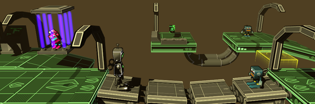

 FXGameSpace 2014 <section class="byline">Published: July 31, 2014</section>
===

About the game
---

  
Every year, lots of kids go to [FXAnimation](http://www.fxanimation.es) to learn how to make a videogame. The course is simple enough to finish it within a month, but they learn many real concepts, like modeling, texturing, animating and (my part) designing. In the second half, I share with them a Unity project that is ready to start mounting a level for a platform/exploration game, complete with characters, props and scripts.

I did all the programming (including a couple of editor tools to build bridges, etc.) and some basic modeling with Blender. {{site.3dkiwi}} did the vast majority of the modeling and texturing. {{site.ismael}} did all the animations.

This is a build with four levels I designed during the course. Try it!

You can download it for [Windows](../files/FXGameSpace2014_win.zip) and [Mac OSX](../files/FXGameSpace2014_mac.zip).
