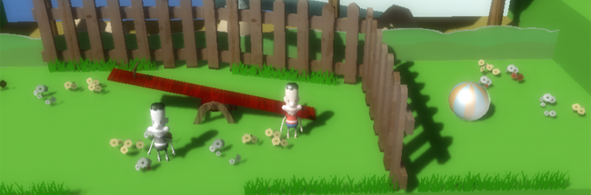

{{page.title}}<section class="byline">Published: July 31, 2014</section>
===

You're a brat trying to solve daily problems. Your experience helps you and makes you solve all daily problems. This experience is you affronting the same problem and failing. Probably you can use your past to solve it... Eventually our brat will grow up and become a older boy. 

It was a project for the Global Game Jam 2012. I did most of the programming. {{page.bud}} did programming, sfx and music. {{site.rtypex}}, {{site.raulj}} and {{site.xavi}} did all the art.

We won the 2nd local prize!

Here is [the GGJ archive page of Immaturity](http://archive.globalgamejam.org/2012/immaturity).

You can download it for [Windows](../files/Immaturity_win.zip) and [Mac OSX](../files/Immaturity_mac.zip).
