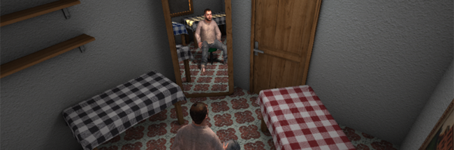

<h1>
{{page.title}}
<section class="byline">Published: 2010</section>
</h1>

While I was working at [EVENTLab](http://www.event-lab.org/) I helped to build and execute an experiment. This experiment aimed to measure how different kinds of input and visualization affected the presence perception in a virtual reality environment. All this research and its results were published in a technical paper called [Simulating Virtual Environments within Virtual Environments as the Basis for a Psychophysics of Presence](../files/a92-slater.pdf) at SIGGRAPH 2010.

In the experiment, a person wearing a fullbody MoCap suit was tracked and a virtual avatar replicated her movements. This person could see her virtual self via an HMD, immersed in a small room with a couple of tables and a mirror.

My tasks
---

To model and texture the scene in which the participants would appear, to integrate and help debug the library that maps a real body to the virtual avatar, to implement the various input and visualization methods and finally to execute the experiment to many random people.

Credits
---

- Researched, written and led by {{site.melslater}}
- Programmed by {{site.me}} and {{site.bernhard}}
- Scene models and textures by {{site.me}}
