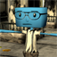

<h1>
{{page.title}}
<section class="byline">Not yet published</section>
</h1>

This is my current star project and also the biggest and slowest one. The time I'm normally dedicating to it is not what it deserves, but one sometimes feels the need to start something fresh or, more importantly, to finish something. That's why this project has had to wait many times. But it's far from abandoned!

It's a graphical adventure with which I want to experiment with what I learnt about narrative. It's meant to be a short game of maybe about 30 minutes (I'll test it when it's finished). And it has not a great, epical story, but one that aims to be simply interesting and engaging, a la Alfred Hitchcock Presents TV series (saving distances).

If you want more information, you can [read its dev blog](http://projectrien.wordpress.com).

Credits
---

- Designed by {{site.me}}
- Programmed by {{site.me}}
- Written by {{site.me}} and {{site.ferminho}}
- Music by {{site.diego}} and {{site.alvaro}}
- Models and textures by {{site.rtypex}} and {{site.me}}
